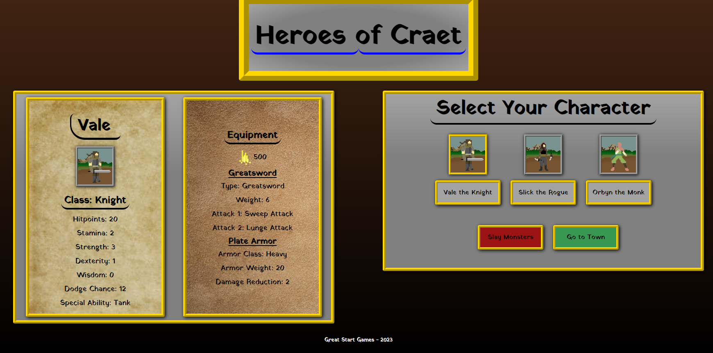

  # Heroes of Craet
 
  
 
  ## Table of Contents
  
  [Description](#description)

  [Installation](#installation)
  
  [Usage](#usage)

  [Contribute](#contribute)

  [Test](#test)
  
  [Credits](#credits)
  
  [License](#license)

  [Questions](#questions)
  
  ## Description
  This application is a game built from scratch using React.js. The game exists in a fictional fantasy world called Craet, where there are monsters that need to be defeated. Users can select  a hero from a list of pre-made characters to use to defeat monsters. When fighting monsters, the combat is turn based. Defeating monsters earns each hero gold.

  ## Installation

  In the project directory, you can run:

### `npm start`

Runs the app in the development mode.\
Open [http://localhost:3000](http://localhost:3000) to view it in your browser.

The page will reload when you make changes.\
You may also see any lint errors in the console.

  You can also run the deployed application in any web browser using the link below:

   Deployed Application: https://adamjohnson92.github.io/Heroes-of-Craet/

  ## Usage
  Users can select a hero from the rost that is presented on the front page. Selecting a hero will pull up their character sheet with their stats and equipment. Once you have found a hero that you want to play as, click the red "Slay Monsters" button. This will take you into turn based combat with a randomly generated monster. Every time you use an action, you will deplete your green stamina bar. Once your character is out of stamina, it will be the monsters turn. Once the monster is out of stamina, it will return to being your turn. Your character will have two attack options, based on the weapon that they have equipped, each with varying chances to hit the enemy and deal various amounts of damage. Each character also has a special defensive ability that can make them more prepared for the monster's next attack. Each character also has a health potion bottle that they can drink to heal damage. Once a monster is defeated, the hero earns gold.

  
  
  
  ## Contribute

  [GitHub Repo: (https://github.com/AdamJohnson92/Heroes-of-Craet)]

  
  ## Credits
  The pixel art for the monster Bad Frog was designed by my wife Anna Price. 

  ## License
  
  
  
  This project is licensed under the terms of the MIT license.

  ## Questions?

  Contact me at:

  GitHub: https://github.com/AdamJohnson92
  
  email: adamgjohnson92@gmail.com

